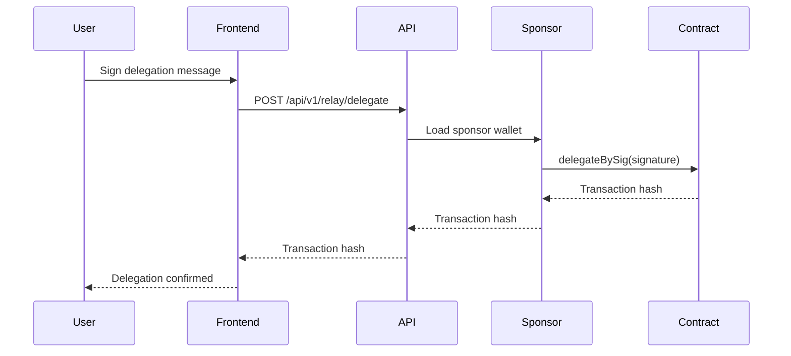

Agora's gasless transaction system enables users to delegate voting power and cast votes without paying gas fees. A relay service sponsors transactions by accepting EIP-712 signatures and submitting them on-chain.

## Overview

The relay system supports two primary operations:

- **Gasless Delegation** - Delegate tokens without gas via `delegateBySig`
- **Gasless Voting** - Cast votes without gas via `castVoteBySig`

Both use the same pattern: users sign messages off-chain, and a sponsored wallet submits the signature on-chain.

## Architecture



## Configuration

### Environment Setup

Configure the gas sponsor wallet:

```bash
# Private key of wallet that will pay gas fees
GAS_SPONSOR_PK=0x...

# The sponsor wallet must have sufficient ETH balance
```

<Warning>
  The `GAS_SPONSOR_PK` private key must be kept secure. It should have sufficient ETH to sponsor transactions but shouldn't hold excessive funds. Monitor balance regularly.
</Warning>

### Relay Status

Check the sponsor wallet status:

```typescript
// src/app/api/v1/relay/getRelayStatus.ts:9
async function getRelayStatus() {
  const SPONSOR_PRIVATE_KEY = process.env.GAS_SPONSOR_PK;
  if (!SPONSOR_PRIVATE_KEY) {
    throw new Error("SPONSOR_PRIVATE_KEY is not set");
  }

  const publicClient = getPublicClient();
  const account = privateKeyToAccount(SPONSOR_PRIVATE_KEY);

  const balance = await publicClient.getBalance({
    address: account.address,
  });

  return {
    balance: Number(formatEther(balance)),
    remaining_votes: Math.floor(Number(formatEther(balance)) / GAS_COST),
  };
}
```

The estimated gas cost per transaction is ~0.001108297 ETH.

## Gasless Delegation

### API Endpoint

```typescript
// POST /api/v1/relay/delegate
{
  "signature": "0x...",
  "delegatee": "0x...",
  "nonce": "0",
  "expiry": 1234567890
}
```

### Implementation

```typescript
// src/app/api/v1/relay/delegate/delegate.ts:9
export async function delegateBySignatureApi({
  signature,
  delegatee,
  nonce,
  expiry,
}: {
  signature: `0x${string}`;
  delegatee: `0x${string}`;
  nonce: string;
  expiry: number;
}): Promise<`0x${string}`> {
  const request = await prepareDelegateBySignatureApi({
    signature,
    delegatee,
    nonce,
    expiry,
  });

  const { governor } = Tenant.current().contracts;
  const transport = getTransportForChain(governor.chain.id);

  const walletClient = createWalletClient({
    chain: governor.chain,
    transport,
  });

  return walletClient.writeContract(request);
}
```

### Signature Preparation

```typescript
// src/app/api/v1/relay/delegate/delegate.ts:38
async function prepareDelegateBySignatureApi({
  signature,
  delegatee,
  nonce,
  expiry,
}) {
  const SPONSOR_PRIVATE_KEY = process.env.GAS_SPONSOR_PK;
  if (!SPONSOR_PRIVATE_KEY || !isHex(SPONSOR_PRIVATE_KEY)) {
    throw new Error("incorrect or missing SPONSOR_PRIVATE_KEY");
  }

  const { token } = Tenant.current().contracts;
  const publicClient = getPublicClient();
  const { r, s, v } = parseSignature(signature);

  if (!v) {
    throw new Error("Unsupported signature type");
  }

  const account = privateKeyToAccount(SPONSOR_PRIVATE_KEY);

  // Simulate transaction before submitting
  const { request } = await publicClient.simulateContract({
    address: token.address,
    abi: token.abi,
    functionName: "delegateBySig",
    args: [delegatee, BigInt(nonce), BigInt(expiry), v, r, s],
    account: account,
  });

  return request;
}
```

## Gasless Voting

### API Endpoint

```typescript
// POST /api/v1/relay/vote
{
  "signature": "0x...",
  "proposalId": "123...",
  "support": 1  // 0=against, 1=for, 2=abstain
}
```

### Implementation

```typescript
// src/app/api/v1/relay/vote/castVote.ts:9
export async function voteBySignatureApi({
  signature,
  proposalId,
  support,
}: {
  signature: `0x${string}`;
  proposalId: string;
  support: number;
}): Promise<`0x${string}`> {
  const request = await prepareVoteBySignatureApi({
    signature,
    proposalId,
    support,
  });

  const { governor } = Tenant.current().contracts;
  const transport = getTransportForChain(governor.chain.id);

  const walletClient = createWalletClient({
    chain: governor.chain,
    transport,
  });

  return walletClient.writeContract(request);
}
```

### Vote Signature Preparation

```typescript
// src/app/api/v1/relay/vote/castVote.ts:35
async function prepareVoteBySignatureApi({
  signature,
  proposalId,
  support,
}) {
  const SPONSOR_PRIVATE_KEY = process.env.GAS_SPONSOR_PK;
  if (!SPONSOR_PRIVATE_KEY || !isHex(SPONSOR_PRIVATE_KEY)) {
    throw new Error("incorrect or missing SPONSOR_PRIVATE_KEY");
  }

  const { governor } = Tenant.current().contracts;
  const publicClient = getPublicClient();
  const { r, s, v } = parseSignature(signature);

  if (!v) {
    throw new Error("Unsupported signature type");
  }

  const account = privateKeyToAccount(SPONSOR_PRIVATE_KEY);

  const { request } = await publicClient.simulateContract({
    address: governor.address,
    abi: governor.abi,
    functionName: "castVoteBySig",
    args: [BigInt(proposalId), support, v, r, s],
    account: account,
  });

  return request;
}
```

## Client-Side Integration

### Signing Delegation

Generate EIP-712 signature for delegation:

```typescript
import { useSignTypedData } from "wagmi";

const { signTypedDataAsync } = useSignTypedData();

const signature = await signTypedDataAsync({
  domain: {
    name: tokenName,
    version: "1",
    chainId,
    verifyingContract: tokenAddress,
  },
  types: {
    Delegation: [
      { name: "delegatee", type: "address" },
      { name: "nonce", type: "uint256" },
      { name: "expiry", type: "uint256" },
    ],
  },
  primaryType: "Delegation",
  message: {
    delegatee,
    nonce,
    expiry,
  },
});
```

### Submitting to Relay

```typescript
const response = await fetch("/api/v1/relay/delegate", {
  method: "POST",
  headers: {
    "Content-Type": "application/json",
    "Authorization": `Bearer ${apiKey}`,
  },
  body: JSON.stringify({
    signature,
    delegatee,
    nonce: nonce.toString(),
    expiry,
  }),
});

const { hash } = await response.json();

// Wait for transaction confirmation
await waitForTransaction({ hash });
```

### Hook Implementation

```typescript
// src/hooks/useSponsoredDelegation.ts:46
export function useSponsoredDelegation() {
  const { data: nonce } = useNonce();
  const { signTypedDataAsync } = useSignTypedData();

  const delegate = async (delegatee: string) => {
    if (!nonce) {
      throw new Error("Unable to process delegation without nonce.");
    }

    const expiry = Math.floor(Date.now() / 1000) + 86400; // 24 hours

    const signature = await signTypedDataAsync({
      domain: getDelegationDomain(),
      types: DELEGATION_TYPES,
      primaryType: "Delegation",
      message: { delegatee, nonce, expiry },
    });

    const response = await fetch("/api/v1/relay/delegate", {
      method: "POST",
      body: JSON.stringify({ signature, delegatee, nonce, expiry }),
    });

    return response.json();
  };

  return { delegate };
}
```

## Authentication

Relay endpoints require API authentication:

```typescript
// src/app/api/v1/relay/vote/route.ts:3
export async function POST(request: NextRequest) {
  const { authenticateApiUser } = await import("@/app/lib/auth/serverAuth");

  const authResponse = await authenticateApiUser(request);

  if (!authResponse.authenticated) {
    return new Response(authResponse.failReason, { status: 401 });
  }

  // Process relay request...
}
```

Include API key in request headers:

```typescript
headers: {
  "Authorization": `Bearer ${apiKey}`,
}
```

See [API Authentication](/api-reference/authentication) for details.

## Input Validation

Validate relay requests with Zod schemas:

```typescript
import { z } from "zod";

const voteRequestSchema = z.object({
  signature: z.string().regex(/^0x[a-fA-F0-9]+$/),
  proposalId: z.string(),
  support: z.number(),
});

const parsedBody = voteRequestSchema.parse(body);
```

The API validates:
- Signature format (hex string with 0x prefix)
- Proposal ID exists
- Support value is valid (0, 1, or 2)
- Signature hasn't been used (nonce check)
- Signature hasn't expired

## Transaction Simulation

Before submitting, simulate the transaction:

```typescript
const { request } = await publicClient.simulateContract({
  address: contractAddress,
  abi: contractAbi,
  functionName: "delegateBySig",
  args: [delegatee, nonce, expiry, v, r, s],
  account: sponsorAccount,
});

if (!request) {
  throw new Error("Transaction simulation failed");
}
```

Simulation catches errors before spending gas:
- Invalid signatures
- Expired signatures
- Insufficient voting power
- Contract state issues

## Nonce Management

Nonces prevent signature replay attacks:

```typescript
// Get current nonce from token contract
const nonce = await tokenContract.nonces(userAddress);

// New delegations use current nonce
const message = {
  delegatee,
  nonce: nonce.toString(),
  expiry,
};

// Nonce increments automatically after successful delegation
```

<Note>
  Each successful delegation increments the user's nonce, invalidating any pending signatures with old nonces.
</Note>

## Error Handling

Handle common relay errors:

```typescript
try {
  const hash = await delegateBySignatureApi(params);
  return { success: true, hash };
} catch (error: any) {
  if (error.message.includes("nonce")) {
    return { error: "Delegation signature expired or already used" };
  }
  if (error.message.includes("signature")) {
    return { error: "Invalid signature" };
  }
  if (error.message.includes("balance")) {
    return { error: "Sponsor wallet has insufficient balance" };
  }
  return { error: "Transaction failed" };
}
```

## Monitoring & Maintenance

### Balance Monitoring

Monitor sponsor wallet balance:

```typescript
const status = await fetch("/api/v1/relay/status").then(r => r.json());

if (status.balance < 0.1) {
  // Alert: Low sponsor balance
  // Estimated remaining transactions: status.remaining_votes
}
```

### Refilling Strategy

1. **Alert threshold** - Trigger alert at < 0.1 ETH
2. **Refill amount** - Top up to 1 ETH when low
3. **Automated refills** - Set up auto-transfer from treasury
4. **Multiple sponsors** - Use multiple wallets for high-volume periods

### Transaction Tracking

Log relay transactions for monitoring:

```typescript
await prisma.relayTransaction.create({
  data: {
    hash,
    type: "DELEGATION",
    user_address: attester,
    sponsor_address: sponsorAccount.address,
    gas_cost: gasCost.toString(),
    timestamp: new Date(),
  },
});
```

## Gas Optimization

### Batch Operations

For multiple delegations, consider batching:

```typescript
// Batch multiple delegations in one transaction
const batchDelegate = async (delegations: Array<{
  signature: string;
  delegatee: string;
  nonce: string;
  expiry: number;
}>) => {
  // Use multicall contract to batch
  const calls = delegations.map(d => ({
    target: tokenAddress,
    callData: encodeFunctionData({
      abi: tokenAbi,
      functionName: "delegateBySig",
      args: [d.delegatee, d.nonce, d.expiry, ...parseSignature(d.signature)],
    }),
  }));

  return multicall.aggregate(calls);
};
```

### Gas Price Strategy

Optimize gas price for cost efficiency:

```typescript
const gasPrice = await publicClient.getGasPrice();

// Use median gas price, not peak
const medianGasPrice = gasPrice * 9n / 10n; // 90% of current

await walletClient.writeContract({
  ...request,
  gasPrice: medianGasPrice,
});
```

## Security Considerations

<Warning>
  **Private Key Storage**: Never commit `GAS_SPONSOR_PK` to version control. Use secure secrets management (AWS Secrets Manager, HashiCorp Vault, etc.).
</Warning>

### Best Practices

1. **Rate limiting** - Limit relay requests per user (e.g., 10/hour)
2. **Signature validation** - Always verify signatures before submission
3. **Balance alerts** - Monitor sponsor wallet and alert on low balance
4. **Separate wallets** - Use different sponsor wallets for production/staging
5. **Transaction limits** - Set maximum gas price willing to pay
6. **Allowlists** - Consider restricting relay to verified users

### Rate Limiting Example

```typescript
import rateLimit from "express-rate-limit";

const relayLimiter = rateLimit({
  windowMs: 60 * 60 * 1000, // 1 hour
  max: 10, // 10 requests per hour
  message: "Too many relay requests, please try again later",
  keyGenerator: (req) => req.headers.get("x-user-address"),
});
```

## Alternative: Paymaster

For more advanced use cases, consider ERC-4337 paymasters:

```bash
# Alchemy account abstraction
NEXT_PUBLIC_ALCHEMY_SMART_ACCOUNT=
PAYMASTER_SECRET=
```

Paymasters offer:
- **Sponsored transactions** without holding private keys
- **Gas estimation** before submission
- **Batch transactions** natively
- **Policy enforcement** (spending limits, allowlists)

## Troubleshooting

### Transaction fails silently

- Check sponsor wallet has ETH
- Verify signature is valid and not expired
- Ensure nonce is current
- Check contract supports `*BySig` methods

### Nonce mismatch

- Fetch latest nonce before signing
- Don't reuse signatures
- Handle pending transactions properly

### Signature rejected

- Verify EIP-712 domain matches token contract
- Check signature format (v, r, s values)
- Ensure signer owns tokens being delegated

## Related Resources

- [Governance Tokens](/advanced/governance-tokens) - Delegation mechanics
- [Attestations](/advanced/attestations) - Gasless attestation submission
- [API Authentication](/api-reference/authentication) - Securing relay endpoints
- [EIP-712](https://eips.ethereum.org/EIPS/eip-712) - Typed structured data hashing