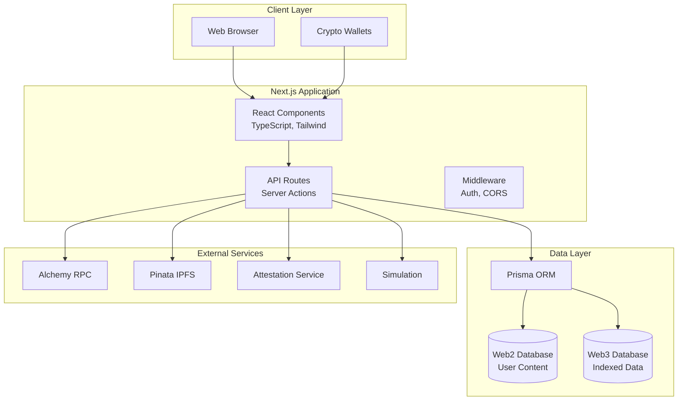
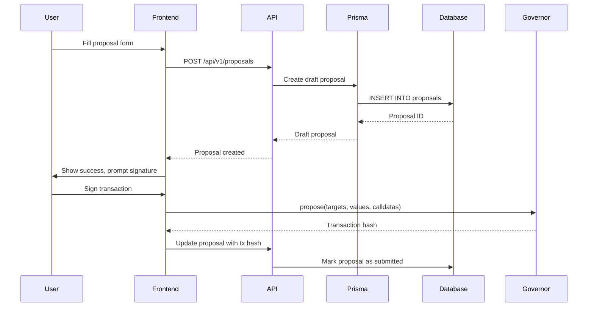
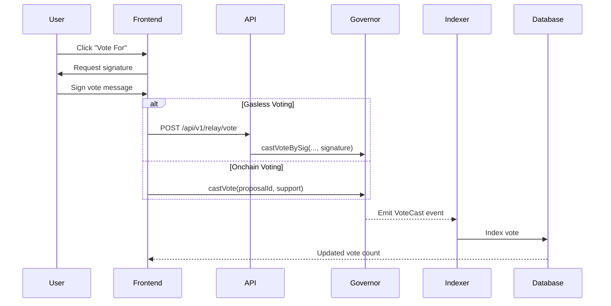

## Overview

Agora is built as a modern, scalable web application using Next.js 14, React, TypeScript, and PostgreSQL. The architecture is designed to support multiple DAOs on a single platform through a multi-tenant system with isolated data and configurations.

## High-Level Architecture



## Multi-Tenant Design

Agora's core architectural pattern is multi-tenancy, allowing multiple DAOs to run on a single codebase and infrastructure while maintaining complete isolation.

### Tenant Configuration

Each DAO is identified by a **tenant namespace** (e.g., `ens`, `optimism`, `uniswap`). The tenant system is implemented in `/src/lib/tenant/`:

```typescript
// Tenant singleton provides DAO-specific configuration
import Tenant from "@/lib/tenant/tenant";

const { namespace, contracts, token, ui } = Tenant.current();

console.log(namespace); // "ens"
console.log(token.symbol); // "ENS"
console.log(contracts.governor.address); // "0x323A76393544d5ecca80cd6ef2A560C6a395b7E3"
```

<Info>
  The tenant is determined by the `NEXT_PUBLIC_AGORA_INSTANCE_NAME` environment variable.
</Info>

### Tenant Components

Each tenant configuration includes:

<Tabs>
  <Tab title="Contracts">
    Blockchain contract addresses and configurations:
    
    ```typescript
    type TenantContracts = {
      governor: TenantContract<IGovernorContract>;
      token: TenantContract<ITokenContract | IMembershipContract>;
      timelock?: TenantContract<BaseContract>;
      staker?: TenantContract<IStaker>;
      alligator?: TenantContract<IAlligatorContract>;
      treasury?: string[];
      votableSupplyOracle?: TenantContract<IVotableSupplyOracleContract>;
      // Additional configuration
      governorType?: GOVERNOR_TYPE;
      timelockType?: TIMELOCK_TYPE;
      delegationModel?: DELEGATION_MODEL;
    };
    ```
    
    Contract configurations are defined in `/src/lib/tenant/configs/contracts/`.
  </Tab>
  
  <Tab title="Token">
    Governance token metadata:
    
    ```typescript
    type TenantToken = {
      name: string;        // "Ethereum Name Service"
      symbol: string;      // "ENS"
      decimals: number;    // 18
      address: string;     // Token contract address
      chainId?: number;    // 1 (Mainnet)
    };
    ```
    
    Supports both ERC20 and ERC721 governance tokens.
  </Tab>
  
  <Tab title="UI Configuration">
    Branding, features, and UI customizations:
    
    ```typescript
    const ui = TenantUIFactory.create(namespace);
    
    // Check if a feature is enabled
    if (ui.toggle("coming-soon")?.enabled) {
      return <ComingSoonPage />;
    }
    
    // Get page metadata
    const page = ui.page("proposals");
    console.log(page.meta.title); // "ENS Proposals"
    ```
    
    UI configs are in `/src/lib/tenant/configs/ui/`.
  </Tab>
  
  <Tab title="Database Schema">
    Each tenant has a dedicated PostgreSQL schema:
    
    - **Namespace schema**: `ens`, `optimism`, `uniswap`, etc.
    - **Isolated tables**: proposals, votes, delegates
    - **Shared data**: Cross-tenant data in `agora` and `config` schemas
    
    ```sql
    -- Example: ENS proposals table
    SELECT * FROM ens.proposals WHERE status = 'active';
    
    -- Shared delegate statements
    SELECT * FROM agora.delegate_statements WHERE dao_slug = 'ens';
    ```
  </Tab>
</Tabs>

### Adding a New Tenant

To add a new DAO to Agora:

<Steps>
  <Step title="Create contract configuration">
    Add a new file in `/src/lib/tenant/configs/contracts/your-dao.ts` with governor, token, and other contract addresses.
  </Step>
  
  <Step title="Create UI configuration">
    Add `/src/lib/tenant/configs/ui/your-dao.ts` with branding, colors, and feature toggles.
  </Step>
  
  <Step title="Update factories">
    Add your DAO namespace to:
    - `TenantContractFactory` in `/src/lib/tenant/tenantContractFactory.ts`
    - `TenantUIFactory` in `/src/lib/tenant/tenantUIFactory.ts`
    - `TenantTokenFactory` in `/src/lib/tenant/tenantTokenFactory.ts`
  </Step>
  
  <Step title="Create database schema">
    Run migrations to create a new schema in PostgreSQL for your DAO's data.
  </Step>
  
  <Step title="Deploy with environment variables">
    Set `NEXT_PUBLIC_AGORA_INSTANCE_NAME=your-dao` when deploying.
  </Step>
</Steps>

## Database Architecture

Agora uses PostgreSQL with Prisma ORM for data persistence. The database is organized into multiple schemas:

### Schema Organization

```
PostgreSQL Database
├── agora (shared cross-tenant data)
│   ├── delegate_statements
│   ├── address_metadata
│   ├── citizens
│   └── badgeholders
├── config (configuration data)
│   └── contracts
├── ens (ENS-specific data)
│   ├── proposals
│   ├── votes
│   ├── delegates
│   └── proposal_lifecycle
├── optimism (Optimism-specific data)
│   ├── proposals
│   ├── votes
│   └── ...
└── uniswap (Uniswap-specific data)
    └── ...
```

### Dual Database Pattern

Agora separates data into two logical databases:

<CardGroup cols={2}>
  <Card title="Web2 Database" icon="database">
    **User-Generated Content**
    
    - Delegate statements and profiles
    - Forum topics and posts
    - User settings and notifications
    - Email preferences
    
    Read-write access for user modifications.
  </Card>
  
  <Card title="Web3 Database" icon="cube">
    **Blockchain-Indexed Data**
    
    - Proposals from governor contracts
    - Votes from onchain events
    - Delegate power calculations
    - Token transfers and balances
    
    Read-only for application (written by indexer).
  </Card>
</CardGroup>

<Tip>
  Configure separate database URLs with `READ_WRITE_WEB2_DATABASE_URL_*` and `READ_ONLY_WEB3_DATABASE_URL_*` environment variables.
</Tip>

### Key Data Models

Agora's data models are defined in the Prisma schema (`/prisma/schema.prisma`):

<Tabs>
  <Tab title="Proposals">
    Governance proposals are stored per-tenant:
    
    ```prisma
    model Proposal {
      id                String
      proposer          String
      title             String?
      description       String?
      status            ProposalStatus
      created_at        DateTime
      updated_at        DateTime
      start_block       BigInt
      end_block         BigInt
      for_votes         Decimal
      against_votes     Decimal
      abstain_votes     Decimal
      // ... additional fields
    }
    ```
    
    Each tenant schema has its own `proposals` table.
  </Tab>
  
  <Tab title="Votes">
    Individual votes cast on proposals:
    
    ```prisma
    model Vote {
      voter        String
      proposal_id  String
      support      Int      // 0=Against, 1=For, 2=Abstain
      weight       Decimal
      reason       String?
      created_at   DateTime
      block_number BigInt
    }
    ```
    
    Votes can be onchain or off-chain (gasless).
  </Tab>
  
  <Tab title="Delegates">
    Delegate profiles and voting power:
    
    ```prisma
    model Delegate {
      address            String
      voting_power       Decimal
      delegated_votes    Decimal
      proposals_created  Int
      proposals_voted    Int
      // Computed fields from views
    }
    ```
    
    Often implemented as materialized views for performance.
  </Tab>
  
  <Tab title="Delegate Statements">
    User-created delegate profiles (shared schema):
    
    ```prisma
    model DelegateStatements {
      address       String
      dao_slug      DaoSlug
      signature     String
      payload       Json
      twitter       String?
      discord       String?
      email         String?
      warpcast      String?
      endorsed      Boolean
      stage         stage_status  // draft | published
    }
    ```
    
    Stored in `agora.delegate_statements` (shared across tenants).
  </Tab>
</Tabs>

### Views and Materialized Views

For performance, Agora uses PostgreSQL views:

- **Views**: Dynamic queries computed on read (e.g., `citizens`, `badgeholders`)
- **Materialized Views**: Precomputed results refreshed periodically (e.g., delegate rankings)

<Warning>
  The database schema is managed in a [separate repository](https://github.com/voteagora/queries). Always pull the latest schema with `npx prisma db pull` before generating the client.
</Warning>

## Application Structure

Agora follows Next.js 14 App Router conventions:

### Directory Structure

```
agora-next/
├── src/
│   ├── app/                    # Next.js App Router
│   │   ├── api/                # API routes
│   │   │   ├── common/         # Shared API utilities
│   │   │   ├── v1/             # API v1 endpoints
│   │   │   └── analytics/      # Analytics endpoints
│   │   ├── proposals/          # Proposals pages
│   │   ├── delegates/          # Delegates pages
│   │   ├── forums/             # Forum pages
│   │   ├── create/             # Proposal creation
│   │   ├── layout.tsx          # Root layout
│   │   └── page.tsx            # Homepage (proposals)
│   ├── components/             # React components
│   │   ├── Proposals/          # Proposal components
│   │   ├── Delegates/          # Delegate components
│   │   ├── Votes/              # Voting components
│   │   ├── Forum/              # Forum components
│   │   ├── Dialogs/            # Modal dialogs
│   │   ├── Layout/             # Layout components
│   │   └── ui/                 # Shared UI components
│   ├── lib/                    # Utilities and helpers
│   │   ├── tenant/             # Multi-tenant system
│   │   ├── contracts/          # Contract ABIs and types
│   │   ├── actions/            # Server actions
│   │   ├── utils.ts            # Utility functions
│   │   └── types.d.ts          # TypeScript types
│   └── styles/                 # Global styles
│       ├── globals.scss        # Global SCSS
│       ├── variables.scss      # SCSS variables (theme)
│       └── theme.js            # JS theme (legacy)
├── prisma/
│   └── schema.prisma           # Prisma schema
├── public/                     # Static assets
├── .env.local                  # Environment variables
├── next.config.js              # Next.js configuration
├── tailwind.config.js          # Tailwind configuration
└── package.json
```

### Key Directories

<AccordionGroup>
  <Accordion title="/src/app">
    **Next.js App Router**
    
    - File-based routing (no Router configuration)
    - Each folder is a route (e.g., `/proposals` → `/src/app/proposals`)
    - `page.tsx` files define route content
    - `layout.tsx` defines shared layouts
    - Server and client components mixed
  </Accordion>
  
  <Accordion title="/src/app/api">
    **API Routes and Server Functions**
    
    - REST API endpoints in `/api/v1/`
    - Data fetching functions in `/api/common/`
    - Server actions for mutations
    - All data access uses Prisma ORM
    - React `cache()` wrapper for request deduplication
  </Accordion>
  
  <Accordion title="/src/components">
    **React Components**
    
    - Organized by feature (Proposals, Delegates, Votes, Forum)
    - Mix of `.tsx` (TypeScript) and `.jsx` (JavaScript)
    - Styled with SCSS modules (`Component.module.scss`)
    - Some use Tailwind utility classes
    - Legacy components use Emotion CSS-in-JS
  </Accordion>
  
  <Accordion title="/src/lib">
    **Utilities and Business Logic**
    
    - `tenant/`: Multi-tenant configuration system
    - `contracts/`: Contract ABIs, TypeChain types, and interfaces
    - `actions/`: Server actions for mutations
    - `utils.ts`: Shared utility functions
    - `types.d.ts`: TypeScript type definitions
  </Accordion>
</AccordionGroup>

## Technology Stack

### Frontend Technologies

<CardGroup cols={2}>
  <Card title="Next.js 14" icon="react">
    React framework with App Router, server components, and API routes. Deployed on Vercel.
  </Card>
  
  <Card title="React 18" icon="react">
    UI library with server and client components, Suspense, and concurrent rendering.
  </Card>
  
  <Card title="TypeScript" icon="code">
    Type-safe JavaScript with comprehensive interfaces and type definitions.
  </Card>
  
  <Card title="Tailwind CSS" icon="paintbrush">
    Utility-first CSS framework. Also uses SCSS modules and legacy Emotion styles.
  </Card>
  
  <Card title="ConnectKit" icon="wallet">
    Wallet connection UI with support for MetaMask, WalletConnect, Coinbase Wallet, etc.
  </Card>
  
  <Card title="Wagmi & Viem" icon="ethereum">
    React hooks and TypeScript library for Ethereum interactions.
  </Card>
</CardGroup>

### Backend Technologies

<CardGroup cols={2}>
  <Card title="Prisma ORM" icon="database">
    Type-safe database client for PostgreSQL with multi-schema support.
  </Card>
  
  <Card title="PostgreSQL" icon="database">
    Relational database with schemas, views, materialized views, and full-text search.
  </Card>
  
  <Card title="Ethers.js v6" icon="cube">
    Ethereum library for contract interactions, TypeChain for type generation.
  </Card>
  
  <Card title="OpenTelemetry" icon="chart-line">
    Distributed tracing, metrics, and observability integration.
  </Card>
</CardGroup>

### External Services

<Tabs>
  <Tab title="Blockchain">
    - **Alchemy**: Primary RPC provider for Ethereum, Optimism, Base, etc.
    - **Etherscan**: Contract verification and ABI fetching
    - **Tenderly**: Transaction simulation for proposal execution preview
    - **EAS**: Ethereum Attestation Service for delegate verification
  </Tab>
  
  <Tab title="Storage & Data">
    - **Pinata**: IPFS pinning for proposal metadata and attachments
    - **AWS S3**: Backup storage for contract ABIs
    - **Redis (Upstash)**: Caching and rate limiting
  </Tab>
  
  <Tab title="Communication">
    - **Mailgun**: Email notifications for proposals and governance events
    - **Notification Center**: Agora's notification service
  </Tab>
  
  <Tab title="Developer Tools">
    - **Vercel**: Hosting and deployment platform
    - **GitHub Actions**: CI/CD for tests, linting, and type checking
    - **Vitest**: Unit testing framework
    - **Cypress**: End-to-end testing
  </Tab>
</Tabs>

## Data Flow

### Proposal Creation Flow



### Voting Flow



## Performance Optimizations

Agora implements several performance optimizations:

<AccordionGroup>
  <Accordion title="Request Deduplication">
    Uses React `cache()` to deduplicate data fetches within a single request:
    
    ```typescript
    import { cache } from 'react';
    
    export const fetchDelegates = cache(async (filter) => {
      return prisma.delegate.findMany({ where: filter });
    });
    ```
    
    Multiple components requesting the same data get cached results.
  </Accordion>
  
  <Accordion title="Materialized Views">
    Precomputed database views for expensive queries:
    
    - Delegate rankings and voting power
    - Proposal statistics and aggregations
    - Refreshed periodically by database triggers
  </Accordion>
  
  <Accordion title="Incremental Static Regeneration">
    Pages are statically generated and revalidated:
    
    ```typescript
    export const revalidate = 60; // Regenerate every 60 seconds
    ```
    
    Balances static site speed with fresh data.
  </Accordion>
  
  <Accordion title="Server Components">
    Next.js server components fetch data on the server, reducing client bundle size and improving initial load time.
  </Accordion>
</AccordionGroup>

## Security Considerations

<Warning>
  **Critical**: Never expose private keys or sensitive credentials in client-side code or environment variables prefixed with `NEXT_PUBLIC_`.
</Warning>

### Security Best Practices

<Steps>
  <Step title="Environment variable separation">
    - `NEXT_PUBLIC_*`: Safe for browser (API keys, public addresses)
    - Server-only: Private keys, database URLs, JWT secrets
  </Step>
  
  <Step title="API authentication">
    - Use API keys for programmatic access
    - JWT tokens for user sessions
    - Rate limiting with Redis
  </Step>
  
  <Step title="Database access">
    - Read-only connection for web3 data
    - Parameterized queries (Prisma prevents SQL injection)
    - Row-level security for multi-tenant isolation
  </Step>
  
  <Step title="Smart contract interactions">
    - Validate all inputs before encoding
    - Simulate transactions with Tenderly before execution
    - Use TypeChain for type-safe contract calls
  </Step>
</Steps>

## Observability

Agora includes comprehensive observability:

- **OpenTelemetry**: Distributed tracing for request flows
- **DataDog**: Application metrics and alerts (optional)
- **Vercel Analytics**: Web vitals and performance monitoring
- **Prisma Logging**: Database query logging in development

Configure with environment variables:

```bash
ENABLE_DD_METRICS=true
DD_API_KEY=your_datadog_key
DD_APP_KEY=your_datadog_app_key
OTEL_EXPORTER_OTLP_ENDPOINT=http://localhost:4318
```

## Next Steps

Now that you understand Agora's architecture:

<CardGroup cols={2}>
  <Card title="Customization Guide" icon="palette" href="/guides/customization">
    Learn how to customize UI, add features, and extend functionality.
  </Card>
  
  <Card title="Deployment Guide" icon="rocket" href="/guides/deployment">
    Deploy Agora to production with Vercel or your own infrastructure.
  </Card>
  
  <Card title="API Reference" icon="code" href="/api/overview">
    Explore the REST API for building integrations and tools.
  </Card>
  
  <Card title="Contributing" icon="github" href="https://github.com/voteagora/agora-next/blob/main/CONTRIBUTING.md">
    Contribute to Agora development on GitHub.
  </Card>
</CardGroup>
