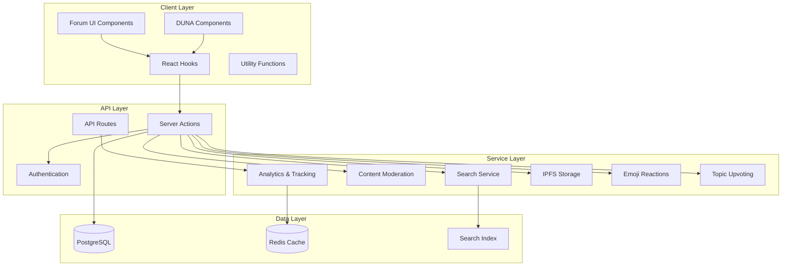
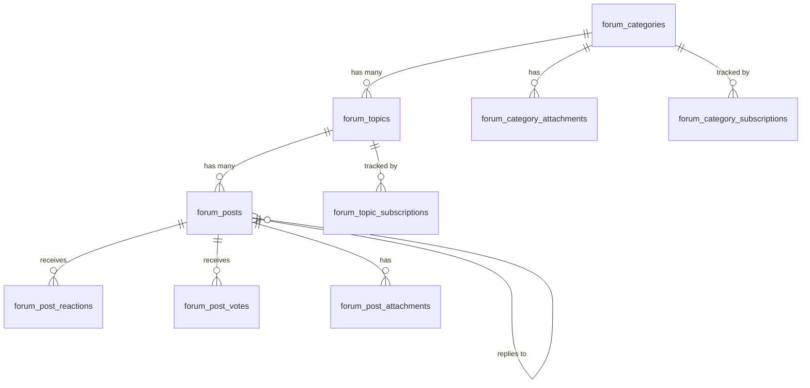
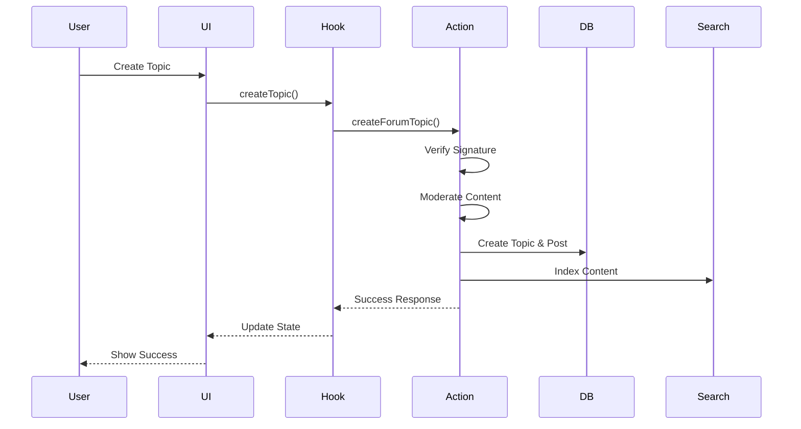

## System Architecture

The forum system uses a layered architecture with clear separation of concerns:



## Database Schema

The forum system uses PostgreSQL with Prisma ORM and follows a multi-tenant architecture where each DAO has its own data isolation through `dao_slug`.

### Core Entities

<Tabs>
  <Tab title="Categories">
    ```prisma
    model forum_categories {
      id               Int       @id @default(autoincrement())
      dao_slug         DaoSlug
      name             String
      description      String?
      created_at       DateTime  @default(now())
      updated_at       DateTime  @updatedAt
      archived         Boolean   @default(false)
      admin_only_topics Boolean  @default(false)
      is_duna          Boolean   @default(false)
      tags             String[]
    }
    ```
    
    Categories organize topics into logical groups. The `admin_only_topics` flag restricts topic creation to admins. The `is_duna` flag marks categories used for DUNA quarterly reports.
  </Tab>
  
  <Tab title="Topics">
    ```prisma
    model forum_topics {
      id           Int       @id @default(autoincrement())
      dao_slug     DaoSlug
      title        String
      address      String
      category_id  Int?
      posts_count  Int       @default(0)
      created_at   DateTime  @default(now())
      updated_at   DateTime  @updatedAt
      archived     Boolean   @default(false)
      deleted_at   DateTime?
      deleted_by   String?
      is_nsfw      Boolean   @default(false)
    }
    ```
    
    Topics are the main discussion threads. They support soft deletion via `deleted_at` and automatic NSFW flagging.
  </Tab>
  
  <Tab title="Posts">
    ```prisma
    model forum_posts {
      id              Int       @id @default(autoincrement())
      dao_slug        DaoSlug
      topic_id        Int
      address         String
      parent_post_id  Int?
      content         String    @db.Text
      created_at      DateTime  @default(now())
      deleted_at      DateTime?
      deleted_by      String?
      is_nsfw         Boolean   @default(false)
    }
    ```
    
    Posts contain the actual content. The `parent_post_id` enables nested replies for threaded conversations.
  </Tab>
  
  <Tab title="Reactions">
    ```prisma
    model forum_post_reactions {
      dao_slug   DaoSlug
      address    String
      post_id    Int
      emoji      String
      created_at DateTime @default(now())
      
      @@id([dao_slug, address, post_id, emoji])
    }
    ```
    
    Reactions allow users to express engagement with emoji. The composite primary key ensures one reaction per emoji per user per post.
  </Tab>
</Tabs>

### Entity Relationships



## Key Design Decisions

<AccordionGroup>
  <Accordion title="Multi-Tenant Architecture">
    Every table includes `dao_slug` for tenant isolation. This enables:
    
    - Complete data separation between DAOs
    - Easy data export and migration per DAO
    - Simplified permission checking
    - Independent configuration per tenant
  </Accordion>
  
  <Accordion title="Post-Centric Design">
    All user interactions (votes, reactions) are post-specific rather than topic-specific:
    
    - Reactions on individual posts, not just topics
    - Granular engagement tracking
    - Better comment threading support
    - More accurate analytics
  </Accordion>
  
  <Accordion title="Soft Deletion">
    Content supports both soft and hard deletion:
    
    - `deleted_at` and `deleted_by` fields track soft deletions
    - Content can be restored by admins
    - Maintains audit trail
    - Protects against accidental deletion
  </Accordion>
  
  <Accordion title="NSFW Detection">
    Automatic content moderation with NSFW flagging:
    
    - Uses OpenAI moderation API
    - Flagged content hidden from public view
    - Admin review workflow
    - Protects community standards
  </Accordion>
</AccordionGroup>

## Data Flow

### Creating a Topic



## File Locations

<CodeGroup>
  ```typescript src/lib/actions/forum/topics.ts
  // Server actions for topic operations
  export async function createForumTopic(
    data: z.infer<typeof createTopicSchema>
  ) {
    // Verify signature
    const isValid = await verifyMessage({
      address: validatedData.address,
      message: validatedData.message,
      signature: validatedData.signature,
    });

    // Moderate content
    const combinedText = `${validatedData.title}\n\n${validatedData.content}`;
    const moderation = await moderateTextContent(combinedText);
    isNsfw = isContentNSFW(moderation);

    // Create topic and first post
    const newTopic = await prismaWeb2Client.forumTopic.create({
      data: {
        title: validatedData.title,
        address: validatedData.address,
        dao_slug: slug,
        categoryId: validatedData.categoryId || null,
        isNsfw,
      },
    });

    // Index for search
    await indexForumTopic({
      topicId: newTopic.id,
      daoSlug: slug,
      title: validatedData.title,
      content: validatedData.content,
      author: validatedData.address,
      categoryId: validatedData.categoryId,
      createdAt: newTopic.createdAt,
    });
  }
  ```
  
  ```typescript src/hooks/useForum.ts
  // React hook for forum operations
  const createTopic = async (
    title: string,
    content: string,
    categoryId?: number
  ) => {
    const address = await requireLogin();
    if (!address) return null;

    const { signature, message } = await signMessage(
      `Create forum topic: ${title}`
    );

    const result = await createForumTopic({
      title,
      content,
      categoryId,
      address,
      signature,
      message,
    });

    return result;
  };
  ```
</CodeGroup>

## Performance Considerations

<CardGroup cols={2}>
  <Card title="Pagination" icon="list">
    All list queries use limit/offset pagination to handle large datasets efficiently
  </Card>
  <Card title="Indexing" icon="database">
    Composite indexes on `(dao_slug, category_id)` and `(dao_slug, topic_id)` for fast queries
  </Card>
  <Card title="Caching" icon="bolt">
    Redis overlay for view counts reduces database load for high-traffic topics
  </Card>
  <Card title="Async Operations" icon="clock">
    Search indexing and moderation run asynchronously to not block user responses
  </Card>
</CardGroup>

## Next Steps

<CardGroup cols={2}>
  <Card title="Topics & Posts" icon="comments" href="/forum/topics-and-posts">
    Learn how to create and manage forum content
  </Card>
  <Card title="Search" icon="magnifying-glass" href="/forum/search">
    Implement full-text search for forum content
  </Card>
</CardGroup>
