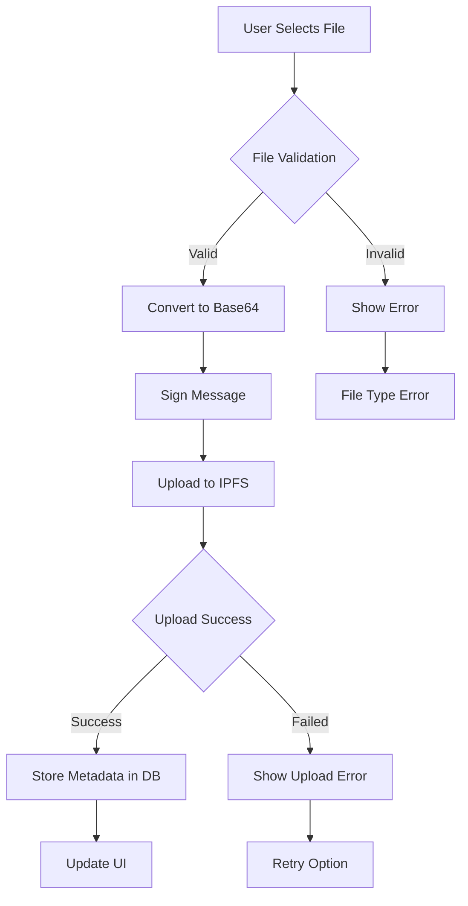

## Overview

The forum system supports decentralized file storage using IPFS (InterPlanetary File System) via Pinata. Files can be attached to both posts and categories.

## File Upload Flow



## IPFS Integration

### Configuration

Set up environment variables for Pinata:

```bash .env
PINATA_API_KEY=your_api_key_here
PINATA_SECRET_KEY=your_secret_key_here
NEXT_PUBLIC_PINATA_GATEWAY=https://gateway.pinata.cloud
```

### Upload to IPFS

```typescript src/lib/pinata.ts
import { uploadFileToPinata, getIPFSUrl } from '@/lib/pinata';

export async function uploadFileToPinata(
  file: File | Buffer,
  metadata: {
    name: string;
    keyvalues: Record<string, any>;
  }
) {
  const formData = new FormData();
  formData.append('file', file);
  formData.append('pinataMetadata', JSON.stringify(metadata));
  
  const response = await fetch(
    'https://api.pinata.cloud/pinning/pinFileToIPFS',
    {
      method: 'POST',
      headers: {
        'pinata_api_key': process.env.PINATA_API_KEY!,
        'pinata_secret_api_key': process.env.PINATA_SECRET_KEY!,
      },
      body: formData,
    }
  );
  
  const result = await response.json();
  return result; // { IpfsHash: 'Qm...', PinSize: 12345, Timestamp: '...' }
}

export function getIPFSUrl(ipfsCid: string): string {
  return `${process.env.NEXT_PUBLIC_PINATA_GATEWAY}/ipfs/${ipfsCid}`;
}
```

## Server Actions

### Upload File

```typescript src/lib/actions/forum/attachments.ts
export async function uploadFileToIPFS(file: File) {
  try {
    const result = await uploadFileToPinata(file, {
      name: file.name,
      keyvalues: {
        type: 'forum-document',
        originalName: file.name,
        contentType: file.type,
        uploadedAt: Date.now(),
      },
    });

    return {
      success: true,
      data: {
        ipfsCid: result.IpfsHash,
        fileName: file.name,
        fileSize: file.size,
        contentType: file.type,
      },
    };
  } catch (error) {
    console.error('Error uploading file to IPFS:', error);
    return {
      success: false,
      error: 'Failed to upload file to IPFS',
    };
  }
}
```

### Upload Document from Base64

```typescript src/lib/actions/forum/attachments.ts
export async function uploadDocumentFromBase64(
  base64Data: string,
  fileName: string,
  contentType: string,
  address: string,
  signature: string,
  message: string,
  categoryId: number
) {
  // Verify signature
  const isValid = await verifyMessage({
    address: address as `0x${string}`,
    message: message,
    signature: signature as `0x${string}`,
  });

  if (!isValid) {
    return { success: false, error: 'Invalid signature' };
  }

  // Convert base64 to buffer
  const base64Content = base64Data.includes(',')
    ? base64Data.split(',')[1]
    : base64Data;
  const buffer = Buffer.from(base64Content, 'base64');

  // Upload to IPFS
  const result = await uploadFileToPinata(buffer, {
    name: fileName,
    keyvalues: {
      type: 'forum-document',
      originalName: fileName,
      contentType: contentType,
      uploadedAt: Date.now(),
    },
  });

  // Store metadata in database
  const document = await prismaWeb2Client.forumCategoryAttachment.create({
    data: {
      fileName: fileName,
      fileSize: buffer.length,
      contentType: contentType,
      ipfsCid: result.IpfsHash,
      address: address,
      dao_slug: slug,
      categoryId: categoryId,
    },
  });

  return {
    success: true,
    data: {
      id: document.id,
      name: document.fileName,
      url: getIPFSUrl(document.ipfsCid),
      ipfsCid: document.ipfsCid,
      createdAt: document.createdAt.toISOString(),
      uploadedBy: address,
    },
  };
}
```

### Get Attachments

```typescript src/lib/actions/forum/attachments.ts
export async function getForumAttachments() {
  const now = new Date();

  // Get post attachments
  const postAttachments = await prismaWeb2Client.forumPostAttachment.findMany({
    where: {
      dao_slug: slug,
      archived: false,
      OR: [
        { revealTime: null, expirationTime: null },
        {
          AND: [
            { OR: [{ revealTime: null }, { revealTime: { lte: now } }] },
            { OR: [{ expirationTime: null }, { expirationTime: { gt: now } }] },
          ],
        },
      ],
    },
    orderBy: { createdAt: 'desc' },
  });

  // Get category attachments
  const categoryAttachments = await prismaWeb2Client.forumCategoryAttachment.findMany({
    where: {
      dao_slug: slug,
      archived: false,
      OR: [
        { revealTime: null, expirationTime: null },
        {
          AND: [
            { OR: [{ revealTime: null }, { revealTime: { lte: now } }] },
            { OR: [{ expirationTime: null }, { expirationTime: { gt: now } }] },
          ],
        },
      ],
    },
    orderBy: { createdAt: 'desc' },
  });

  const attachments = [...postAttachments, ...categoryAttachments];

  return {
    success: true,
    data: attachments.map((attachment: any) => ({
      id: attachment.id,
      name: attachment.fileName,
      url: getIPFSUrl(attachment.ipfsCid),
      ipfsCid: attachment.ipfsCid,
      createdAt: attachment.createdAt.toISOString(),
      uploadedBy: attachment.address,
      archived: attachment.archived,
      isFinancialStatement: attachment.isFinancialStatement ?? false,
      revealTime: attachment.revealTime?.toISOString() ?? null,
      expirationTime: attachment.expirationTime?.toISOString() ?? null,
    })),
  };
}
```

### Delete Attachment

```typescript src/lib/actions/forum/attachments.ts
export async function deleteForumAttachment(
  data: z.infer<typeof deleteAttachmentSchema>
) {
  const validatedData = deleteAttachmentSchema.parse(data);

  // Verify signature
  const isValid = await verifyMessage({
    address: validatedData.address as `0x${string}`,
    message: validatedData.message,
    signature: validatedData.signature as `0x${string}`,
  });

  if (!isValid) {
    return { success: false, error: 'Invalid signature' };
  }

  // Delete from database
  if (validatedData.targetType === 'post') {
    await prismaWeb2Client.forumPostAttachment.delete({
      where: { id: validatedData.attachmentId },
    });
  } else if (validatedData.targetType === 'category') {
    await prismaWeb2Client.forumCategoryAttachment.delete({
      where: { id: validatedData.attachmentId },
    });
  }

  // Log audit action
  if (!validatedData.isAuthor) {
    await logForumAuditAction(
      slug,
      validatedData.address,
      'DELETE_ATTACHMENT',
      'topic',
      validatedData.attachmentId
    );
  }

  return { success: true };
}
```

### Archive Attachment

```typescript src/lib/actions/forum/attachments.ts
export async function archiveForumAttachment(
  data: z.infer<typeof archiveAttachmentSchema>
) {
  const validatedData = archiveAttachmentSchema.parse(data);

  // Verify signature
  const isValid = await verifyMessage({
    address: validatedData.address as `0x${string}`,
    message: validatedData.message,
    signature: validatedData.signature as `0x${string}`,
  });

  if (!isValid) {
    return { success: false, error: 'Invalid signature' };
  }

  // Archive the attachment
  if (validatedData.targetType === 'post') {
    await prismaWeb2Client.forumPostAttachment.update({
      where: { id: validatedData.attachmentId, dao_slug: slug },
      data: { archived: true },
    });
  } else if (validatedData.targetType === 'category') {
    await prismaWeb2Client.forumCategoryAttachment.update({
      where: { id: validatedData.attachmentId, dao_slug: slug },
      data: { archived: true },
    });
  }

  // Log audit action
  if (!validatedData.isAuthor) {
    await logForumAuditAction(
      slug,
      validatedData.address,
      'ARCHIVE_ATTACHMENT',
      'topic',
      validatedData.attachmentId
    );
  }

  return { success: true };
}
```

## React Hook Integration

```typescript src/hooks/useForum.ts
export function useForum() {
  const uploadDocument = async (
    base64Data: string,
    fileName: string,
    contentType: string,
    categoryId: number
  ) => {
    const address = await requireLogin();
    if (!address) return null;

    const { signature, message } = await signMessage(
      `Upload document: ${fileName}`
    );

    const result = await uploadDocumentFromBase64(
      base64Data,
      fileName,
      contentType,
      address,
      signature,
      message,
      categoryId
    );

    return result;
  };

  const deleteAttachment = async (
    attachmentId: number,
    targetType: 'post' | 'category',
    isAuthor: boolean = false
  ) => {
    const address = await requireLogin();
    if (!address) return null;

    const { signature, message } = await signMessage(
      `Delete attachment ${attachmentId}`
    );

    const result = await deleteForumAttachment({
      attachmentId,
      targetType,
      address,
      signature,
      message,
      isAuthor,
    });

    return result;
  };

  return { uploadDocument, deleteAttachment };
}
```

## Database Schema

<Tabs>
  <Tab title="Post Attachments">
    ```sql
    CREATE TABLE forum_post_attachments (
      id               SERIAL PRIMARY KEY,
      dao_slug         VARCHAR NOT NULL,
      post_id          INTEGER NOT NULL,
      ipfs_cid         VARCHAR NOT NULL,
      file_name        VARCHAR NOT NULL,
      content_type     VARCHAR NOT NULL,
      file_size        BIGINT NOT NULL,
      address          VARCHAR NOT NULL,
      archived         BOOLEAN DEFAULT FALSE,
      created_at       TIMESTAMP DEFAULT NOW(),
      reveal_time      TIMESTAMP,
      expiration_time  TIMESTAMP,
      
      FOREIGN KEY (post_id) REFERENCES forum_posts(id) ON DELETE CASCADE
    );
    ```
  </Tab>
  
  <Tab title="Category Attachments">
    ```sql
    CREATE TABLE forum_category_attachments (
      id                    SERIAL PRIMARY KEY,
      dao_slug              VARCHAR NOT NULL,
      category_id           INTEGER NOT NULL,
      ipfs_cid              VARCHAR NOT NULL,
      file_name             VARCHAR NOT NULL,
      content_type          VARCHAR NOT NULL,
      file_size             BIGINT NOT NULL,
      address               VARCHAR NOT NULL,
      archived              BOOLEAN DEFAULT FALSE,
      is_financial_statement BOOLEAN DEFAULT FALSE,
      created_at            TIMESTAMP DEFAULT NOW(),
      reveal_time           TIMESTAMP,
      expiration_time       TIMESTAMP,
      
      FOREIGN KEY (category_id) REFERENCES forum_categories(id) ON DELETE CASCADE
    );
    ```
  </Tab>
</Tabs>

## Attachment Types

### Post Attachments

Attached to individual posts (replies):

- Images embedded in post content
- Documents referenced in discussions
- Supporting materials for arguments

### Category Attachments

Attached to categories (used for DUNA documents):

- Quarterly reports
- Financial statements
- Governance documents
- Legal filings

## File Type Support

<AccordionGroup>
  <Accordion title="Documents">
    - PDF (.pdf)
    - Word (.doc, .docx)
    - Text (.txt, .md)
    - Spreadsheets (.xls, .xlsx, .csv)
  </Accordion>
  
  <Accordion title="Images">
    - JPEG (.jpg, .jpeg)
    - PNG (.png)
    - GIF (.gif)
    - WebP (.webp)
    - SVG (.svg)
  </Accordion>
  
  <Accordion title="Archives">
    - ZIP (.zip)
    - TAR (.tar, .tar.gz)
  </Accordion>
</AccordionGroup>

## Timed Attachments

Attachments support reveal and expiration times for scheduled releases:

```typescript
interface TimedAttachment {
  revealTime: Date | null;      // When attachment becomes visible
  expirationTime: Date | null;  // When attachment expires
}

// Example: Financial statement revealed quarterly
const attachment = {
  fileName: 'Q1-2024-Financial-Statement.pdf',
  revealTime: new Date('2024-04-01'),
  expirationTime: null, // Never expires
};
```

## Best Practices

<AccordionGroup>
  <Accordion title="Validate file types">
    Always validate file types on both client and server to prevent malicious uploads.
  </Accordion>
  
  <Accordion title="Set size limits">
    Enforce reasonable file size limits to prevent abuse (typically 10-50 MB).
  </Accordion>
  
  <Accordion title="Use content addressing">
    IPFS automatically provides content addressing - files are identified by their hash.
  </Accordion>
  
  <Accordion title="Store metadata">
    Keep file metadata (name, size, type, uploader) in your database for quick access.
  </Accordion>
  
  <Accordion title="Handle CORS">
    Ensure your IPFS gateway is configured to allow CORS for your domain.
  </Accordion>
</AccordionGroup>

## Next Steps

<CardGroup cols={2}>
  <Card title="DUNA Integration" icon="building-columns" href="/forum/duna-integration">
    Learn about DUNA-specific document management
  </Card>
  <Card title="Moderation" icon="gavel" href="/forum/moderation">
    Moderate and manage uploaded attachments
  </Card>
</CardGroup>
