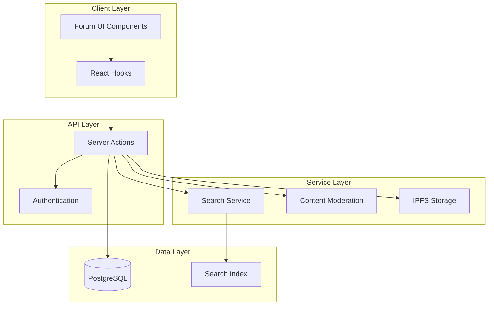

## Overview

The Agora Forum system is a comprehensive discussion platform built for DAO governance and community engagement. It provides a multi-tenant architecture supporting categories, topics, posts, attachments, reactions, upvoting, and advanced moderation features.

<CardGroup cols={2}>
  <Card title="Multi-tenant Architecture" icon="building">
    Isolated data per DAO using `dao_slug` for complete data separation
  </Card>
  <Card title="Real-time Interactions" icon="bolt">
    Emoji reactions, upvoting, and live updates for engaging discussions
  </Card>
  <Card title="Content Moderation" icon="shield-check">
    NSFW detection, soft/hard deletion, and archival capabilities
  </Card>
  <Card title="File Management" icon="file">
    IPFS-based document storage and sharing with content addressing
  </Card>
</CardGroup>

## Key Features

### Discussion Features

- **Categories & Topics**: Organize discussions into categories with topic threads
- **Nested Replies**: Support for threaded conversations with parent-child post relationships
- **Rich Content**: Markdown support with inline attachments and images
- **Reactions**: Express engagement with emoji reactions on any post
- **Upvoting**: Community-driven content curation through topic upvotes

### Moderation & Security

- **Automatic NSFW Detection**: Content filtering using OpenAI moderation service
- **Soft & Hard Deletion**: Flexible content removal with recovery options
- **Archive System**: Move content to archived state without deletion
- **Role-based Permissions**: Granular access control with admin hierarchy
- **Audit Logging**: Complete trail of all administrative actions

### Integration Features

- **Search Integration**: Full-text search with real-time indexing
- **DUNA Support**: Specialized components for quarterly reports and documents
- **Subscription System**: Follow topics and categories for notifications
- **Analytics**: View tracking and engagement metrics
- **IPFS Storage**: Decentralized file storage with Pinata integration

## System Requirements

<AccordionGroup>
  <Accordion title="Database">
    PostgreSQL with Prisma ORM for reliable data management
  </Accordion>
  <Accordion title="Storage">
    IPFS via Pinata for decentralized file storage
  </Accordion>
  <Accordion title="Search">
    Search service integration for full-text indexing
  </Accordion>
  <Accordion title="Authentication">
    Web3 wallet integration with signature verification
  </Accordion>
</AccordionGroup>

## Quick Start

<Steps>
  <Step title="Connect Wallet">
    Users must connect their Web3 wallet to participate in discussions
  </Step>
  <Step title="Browse Categories">
    Explore forum categories to find relevant discussions
  </Step>
  <Step title="Create Topics">
    Start new discussions by creating topics (with sufficient voting power)
  </Step>
  <Step title="Engage">
    Reply to posts, add reactions, and upvote quality content
  </Step>
</Steps>

## Architecture Overview

The forum system follows a layered architecture:

## Next Steps

<CardGroup cols={2}>
  <Card title="Architecture" icon="sitemap" href="/forum/architecture">
    Learn about the database schema and system design
  </Card>
  <Card title="Topics & Posts" icon="comments" href="/forum/topics-and-posts">
    Understand how to create and manage forum content
  </Card>
  <Card title="Reactions" icon="face-smile" href="/forum/reactions">
    Add emoji reactions and upvoting to your forum
  </Card>
  <Card title="Moderation" icon="gavel" href="/forum/moderation">
    Set up content moderation and admin tools
  </Card>
</CardGroup>
