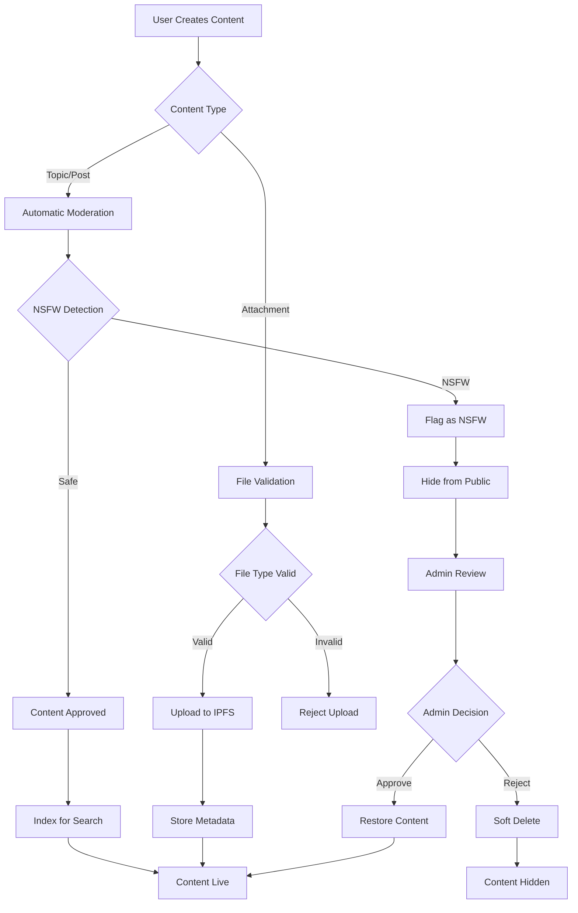

## Overview

The forum system includes comprehensive moderation features including automatic NSFW detection, soft/hard deletion, archival, and role-based permission controls.

## Moderation Flow



## Automatic Moderation

### NSFW Detection

All content is automatically moderated using the OpenAI moderation API:

```typescript src/lib/moderation.ts
import { moderateTextContent, isContentNSFW } from '@/lib/moderation';

export async function moderateTextContent(text: string) {
  const response = await openai.moderations.create({
    input: text,
  });
  
  return response.results[0];
}

export function isContentNSFW(moderation: Moderation): boolean {
  return moderation.flagged && (
    moderation.categories.sexual ||
    moderation.categories['sexual/minors'] ||
    moderation.categories.violence ||
    moderation.categories['violence/graphic']
  );
}
```

### Content Filtering

NSFW content is automatically filtered from public queries:

```typescript src/lib/actions/forum/topics.ts
// Get topics - excludes NSFW content
const topics = await prismaWeb2Client.forumTopic.findMany({
  where: {
    dao_slug: slug,
    archived: false,
    isNsfw: false,  // Filter NSFW content
    deletedAt: null,
  },
  include: {
    posts: {
      where: { isNsfw: false },  // Also filter NSFW posts
    },
  },
});
```

## Manual Moderation

### Soft Delete

Soft deletion hides content but preserves it for potential recovery:

```typescript src/lib/actions/forum/topics.ts
export async function softDeleteForumTopic(
  data: z.infer<typeof softDeleteTopicSchema>
) {
  // Verify signature and check permission
  await requirePermission({
    address: validatedData.address,
    message: validatedData.message,
    signature: validatedData.signature,
    daoSlug: slug as any,
    module: 'forums',
    resource: 'topics',
    action: 'archive',
  });

  // Soft delete the topic
  await prismaWeb2Client.forumTopic.update({
    where: {
      id: validatedData.topicId,
      dao_slug: slug,
    },
    data: {
      deletedAt: new Date(),
      deletedBy: validatedData.address,
    },
  });

  // Remove from search index
  await removeForumTopicFromIndex(validatedData.topicId, slug);

  return { success: true };
}
```

### Restore Deleted Content

```typescript src/lib/actions/forum/topics.ts
export async function restoreForumTopic(
  data: z.infer<typeof softDeleteTopicSchema>
) {
  // Verify permission
  await requirePermission({
    address: validatedData.address,
    message: validatedData.message,
    signature: validatedData.signature,
    daoSlug: slug as any,
    module: 'forums',
    resource: 'topics',
    action: 'archive',
  });

  // Restore the topic
  await prismaWeb2Client.forumTopic.update({
    where: {
      id: validatedData.topicId,
      dao_slug: slug,
    },
    data: {
      deletedAt: null,
      deletedBy: null,
    },
  });

  // Log admin action
  if (!validatedData.isAuthor) {
    await logForumAuditAction(
      slug,
      validatedData.address,
      'RESTORE_TOPIC',
      'topic',
      validatedData.topicId
    );
  }

  // Re-index for search
  const restoredTopic = await prismaWeb2Client.forumTopic.findUnique({
    where: { id: validatedData.topicId },
    include: { posts: { take: 1, orderBy: { createdAt: 'asc' } } },
  });

  if (restoredTopic) {
    await indexForumTopic({
      topicId: restoredTopic.id,
      daoSlug: slug,
      title: restoredTopic.title,
      content: restoredTopic.posts[0]?.content || '',
      author: restoredTopic.address,
      categoryId: restoredTopic.categoryId,
      createdAt: restoredTopic.createdAt,
    });
  }

  return { success: true };
}
```

### Hard Delete

Permanent deletion removes content from the database:

```typescript src/lib/actions/forum/topics.ts
export async function deleteForumTopic(
  data: z.infer<typeof deleteTopicSchema>
) {
  // Verify signature
  const isValid = await verifyMessage({
    address: validatedData.address,
    message: validatedData.message,
    signature: validatedData.signature,
  });

  if (!isValid) {
    return { success: false, error: 'Invalid signature' };
  }

  // Check ownership or admin permission
  const topic = await prismaWeb2Client.forumTopic.findUnique({
    where: { id: validatedData.topicId },
  });

  if (!topic) {
    return { success: false, error: 'Topic not found' };
  }

  if (topic.address !== validatedData.address) {
    return { success: false, error: 'Unauthorized' };
  }

  // Delete all posts first (cascade)
  await prismaWeb2Client.forumPost.deleteMany({
    where: {
      topicId: validatedData.topicId,
      dao_slug: slug,
    },
  });

  // Delete the topic
  await prismaWeb2Client.forumTopic.delete({
    where: { id: validatedData.topicId },
  });

  // Log audit action
  await logForumAuditAction(
    slug,
    validatedData.address,
    'DELETE_TOPIC',
    'topic',
    validatedData.topicId
  );

  return { success: true };
}
```

### Archive Content

Archiving moves content to an archived state:

```typescript src/lib/actions/forum/topics.ts
export async function archiveForumTopic(
  data: z.infer<typeof archiveTopicSchema>
) {
  // Verify permission
  await requirePermission({
    address: validatedData.address,
    message: validatedData.message,
    signature: validatedData.signature,
    daoSlug: slug as any,
    module: 'forums',
    resource: 'topics',
    action: 'archive',
  });

  await prismaWeb2Client.forumTopic.update({
    where: {
      id: validatedData.topicId,
      dao_slug: slug,
    },
    data: {
      archived: true,
    },
  });

  // Log if admin action
  if (!validatedData.isAuthor) {
    await logForumAuditAction(
      slug,
      validatedData.address,
      'ARCHIVE_TOPIC',
      'topic',
      validatedData.topicId
    );
  }

  return { success: true };
}
```

## Permission System

### RBAC Integration

The forum uses a role-based access control (RBAC) system:

```typescript src/lib/actions/forum/admin.ts
export async function checkForumPermissions(
  address: string,
  _categoryId?: number
) {
  const { slug } = Tenant.current();
  const daoSlug = slug as DaoSlug;

  // Check if super admin (has all permissions)
  const superAdmin = await isSuperAdmin(address);
  if (superAdmin) {
    return {
      isAdmin: true,
      canCreateTopics: true,
      canManageTopics: true,
    };
  }

  // Check specific RBAC permissions
  const [canCreateTopics, canManageTopics] = await Promise.all([
    checkPermission(address, daoSlug, 'forums', 'topics', 'create'),
    checkPermission(address, daoSlug, 'forums', 'topics', 'archive'),
  ]);

  return {
    isAdmin: canManageTopics,
    canCreateTopics,
    canManageTopics,
  };
}
```

### Permission Modules

Available permission modules:

- `forums.topics.create` - Create new topics
- `forums.topics.archive` - Archive, restore, and soft delete topics
- `forums.posts.create` - Create posts (bypasses VP requirements)
- `forums.attachments.create` - Upload attachments
- `forums.attachments.manage` - Delete/archive attachments

### Using Permissions in Components

```typescript
import { useForumAdmin } from '@/hooks/useForumAdmin';

function TopicCard({ topic }) {
  const { canManageTopics, isAdmin } = useForumAdmin(topic.categoryId);
  
  return (
    <div>
      <h3>{topic.title}</h3>
      
      {canManageTopics && (
        <button onClick={() => archiveTopic(topic.id)}>
          Archive
        </button>
      )}
      
      {isAdmin && (
        <button onClick={() => deleteTopic(topic.id)}>
          Delete
        </button>
      )}
    </div>
  );
}
```

## Admin Roles

### Role Hierarchy

1. **Super Admin** - Has all permissions across all DAOs
2. **Admin** - Can manage topics, posts, and moderate content
3. **DUNA Admin** - Specialized role for DUNA category management

### Admin Badge

Display admin badges on user content:

```typescript src/components/Forum/ForumAdminBadge.tsx
import ForumAdminBadge from '@/components/Forum/ForumAdminBadge';

function UserAvatar({ address, role }) {
  return (
    <div className="relative">
      <Avatar address={address} />
      {role && <ForumAdminBadge role={role} />}
    </div>
  );
}
```

## Audit Logging

All admin actions are logged for accountability:

```typescript src/lib/actions/forum/admin.ts
export async function logForumAuditAction(
  daoSlug: string,
  adminAddress: string,
  action: string,
  targetType: 'topic' | 'post',
  targetId: number
): Promise<void> {
  try {
    await prismaWeb2Client.forumAuditLog.create({
      data: {
        dao_slug: daoSlug as any,
        adminAddress,
        action,
        targetType,
        targetId,
      },
    });
  } catch (error) {
    console.error('Failed to log forum audit action:', error);
  }
}
```

### Audit Log Schema

```sql
CREATE TABLE forum_audit_logs (
  id             SERIAL PRIMARY KEY,
  dao_slug       VARCHAR NOT NULL,
  admin_address  VARCHAR NOT NULL,
  action         VARCHAR NOT NULL,
  target_type    VARCHAR NOT NULL,
  target_id      INTEGER NOT NULL,
  created_at     TIMESTAMP DEFAULT NOW()
);
```

### Tracked Actions

- `DELETE_TOPIC` - Hard delete topic
- `RESTORE_TOPIC` - Restore soft-deleted topic
- `ARCHIVE_TOPIC` - Archive topic
- `DELETE_POST` - Hard delete post
- `RESTORE_POST` - Restore soft-deleted post
- `DELETE_ATTACHMENT` - Delete attachment
- `ARCHIVE_ATTACHMENT` - Archive attachment

## Soft Deleted Content Display

Show soft-deleted content to authors and admins:

```typescript src/components/Forum/SoftDeletedContent.tsx
import { SoftDeletedContent } from '@/components/Forum/SoftDeletedContent';

function TopicCard({ topic, currentUser, isAdmin }) {
  if (topic.deletedAt) {
    const canView = 
      topic.address === currentUser.address || 
      isAdmin;
    
    if (!canView) {
      return null; // Hide from others
    }
    
    return (
      <SoftDeletedContent
        type="topic"
        deletedAt={topic.deletedAt}
        deletedBy={topic.deletedBy}
        onRestore={() => restoreTopic(topic.id)}
      >
        <TopicContent topic={topic} />
      </SoftDeletedContent>
    );
  }
  
  return <TopicContent topic={topic} />;
}
```

## Permission Utilities

```typescript src/lib/forumUtils.ts
export function canArchiveContent(
  userAddress: string,
  contentAuthor: string,
  isAdmin: boolean,
  isModerator: boolean
): boolean {
  // Author can archive their own content
  if (userAddress.toLowerCase() === contentAuthor.toLowerCase()) {
    return true;
  }
  
  // Admins and moderators can archive any content
  return isAdmin || isModerator;
}

export function canDeleteContent(
  userAddress: string,
  contentAuthor: string,
  isAdmin: boolean,
  isModerator: boolean
): boolean {
  // Only admins can hard delete
  if (isAdmin) {
    return true;
  }
  
  // Authors can delete their own content
  if (userAddress.toLowerCase() === contentAuthor.toLowerCase()) {
    return true;
  }
  
  return false;
}
```

## Best Practices

<AccordionGroup>
  <Accordion title="Use soft deletion by default">
    Prefer soft deletion over hard deletion to allow content recovery and maintain data integrity.
  </Accordion>
  
  <Accordion title="Log all admin actions">
    Always log administrative actions for accountability and auditing purposes.
  </Accordion>
  
  <Accordion title="Verify permissions">
    Check permissions on both client and server side for security.
  </Accordion>
  
  <Accordion title="Filter NSFW content">
    Always exclude NSFW content from public queries while preserving it for admin review.
  </Accordion>
  
  <Accordion title="Provide restoration options">
    Give admins the ability to restore accidentally deleted content.
  </Accordion>
</AccordionGroup>

## Next Steps

<CardGroup cols={2}>
  <Card title="Topics & Posts" icon="comments" href="/forum/topics-and-posts">
    Learn about creating and managing content
  </Card>
  <Card title="Search" icon="magnifying-glass" href="/forum/search">
    Update search indexes when moderating content
  </Card>
</CardGroup>
